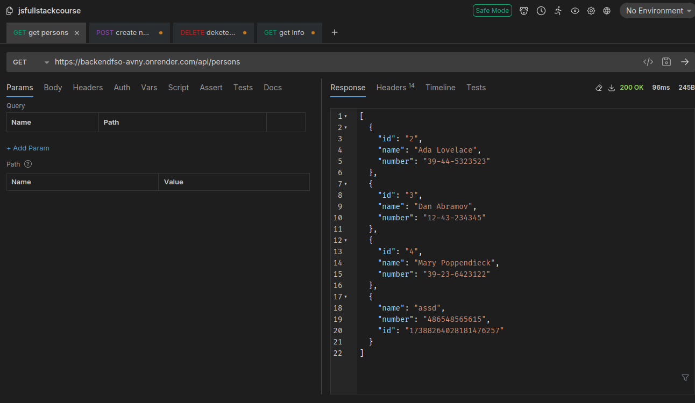

link to online application: https://backendfso-avny.onrender.com

notes:
I use bruno instead of postman
picture to illustrate to how making calls looks and that it works

before 3.13 I used the custom id in the exercises for longer than it was needed, but I fixed it later

At around 3.13-3.14 I did a bit more then I was asked, so latter parts were sometimes done or almost done.

3.22: added "eslint-config-prettier" since I use prettier, so eslint and prettier don't fight with each other, and used the config file from the last example, but alot of those rules were dissabled by the "eslint-config-prettier". After doing so 5 problems were still found.
